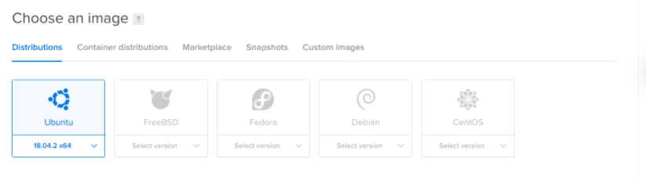
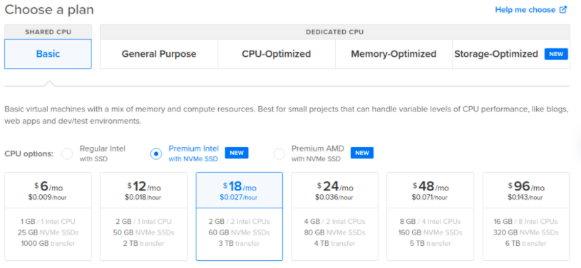
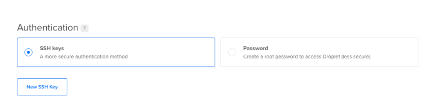

# Create VM on Digital Ocean
* [Go to Control Panel](#Go-to-Control-Panel)
* [Choose an image](#Choose-an-image)
* [Setup](#Setup)

Linux-Remote Server are Linux-based virtual machines (VMs) that run on top of virtualized hardware
VMs are managed using a terminal and SSH. You’ll need to have an SSH client and, optionally, an SSH key pair. Clients generally authenticate either using passwords (which are less secure and not recommended) or SSH keys (which are very secure and strongly recommended).
We recommend you use SSH keys to connect to your VM.

## Go to Control Panel
Create DigitalOcean account from https://cloud.digitalocean.com/registrations/new

Log in to the control panel https://cloud.digitalocean.com/login , click the green Create button in the top right to open the create menu.

Click Droplets to open the Droplet create page. Choose your Droplet’s configuration, its operating system, howmemory, and which features (like backups or monitoring) to enable.

In the Choose a plan section,choose the amount of RAM, storage space, and CPU cores your want.

In the Authentication section, choose the method you want to use to log in to your Droplet. There are two options:

- SSH keys, which provide more security than a password.
- Password, which allows you to create your own password for the new Droplet.

# Setup
## Choose an image
In the Choose an image section, choose the image  from: 

- Distributions are basic Unix-like images with no additional software, including Ubuntu, Fedora, Debian, CentOS, and FreeBSD.

- Container distributions include RancherOS.

- Marketplace images include pre-configured applications, like Docker, WordPress, or LAMP, to help simplify getting started.

- Custom images are Unix-like images that you create and upload to your DigitalOcean account.

Choose the image with the system you desire

## Choose plan
In the plan section, you choose the amount of RAM, storage space, and CPU cores your Droplet will have.

## Authentication
Choose the method you want to use to log in to your Droplet. There are two options:

- SSH keys, which provide more security than a password.
- Password, which allows you to create your own password for the new Droplet.

Congratulations! You now have a droplet on Digital Ocean and must add an ssh key to your droplet to connect to it remotely
