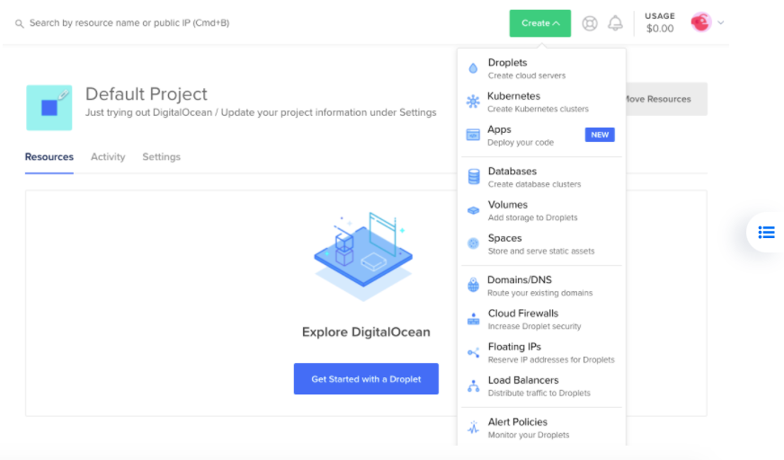

## Table of contents
* [Create VM aka droplet](#Create-VM-aka-droplet)
* [Technologies](#technologies)
* [Setup](#setup)

Linux-Remote Server are Linux-based virtual machines (VMs) that run on top of virtualized hardware
VMs are managed using a terminal and SSH. You’ll need to have an SSH client and, optionally, an SSH key pair. Clients generally authenticate either using passwords (which are less secure and not recommended) or SSH keys (which are very secure and strongly recommended).
We recommend you use SSH keys to connect to your VM.

## Create VM aka droplet
Create DigitalOcean account from https://cloud.digitalocean.com/registrations/new
	
## Technologies
Project is created with:
* Lorem version: 12.3
* Ipsum version: 2.33
* Ament library version: 999
	
## Setup
To run this project, install it locally using npm:

```
$ cd ../lorem
$ npm install
$ npm start
```


